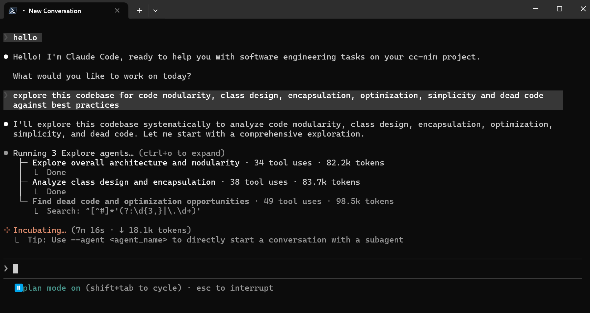
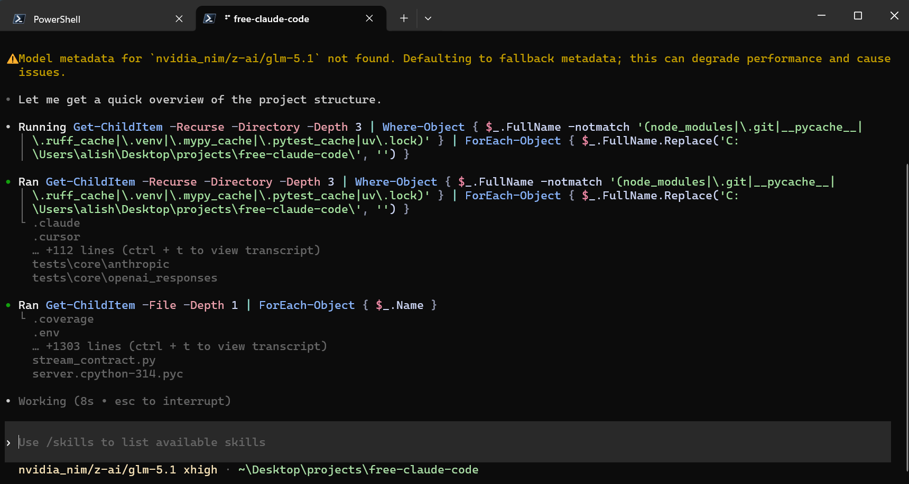
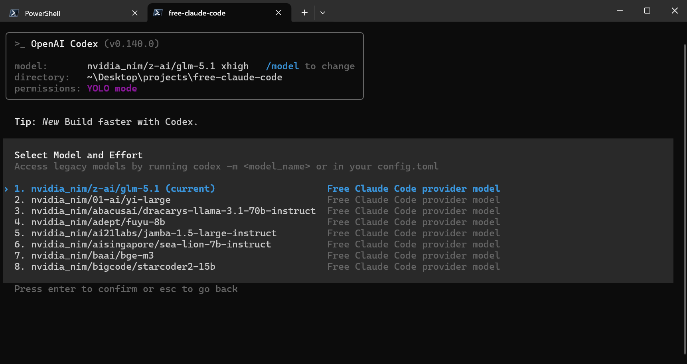

<div align="center">

<h1>
  <picture>
    <source media="(prefers-color-scheme: light)" srcset="assets/claudey-wordmark-light.svg">
    
  </picture>
</h1>

Use Claude Code, Codex, Pi, or their IDE extensions through your own provider-backed proxy.

[](https://opensource.org/licenses/MIT)
[](https://www.python.org/downloads/)
[](https://github.com/astral-sh/uv)
[](https://github.com/vzfghc/claudey/actions/workflows/tests.yml)
[](https://pypi.org/project/ty/)
[](https://github.com/astral-sh/ruff)
[](https://github.com/Delgan/loguru)

Run your coding agents with free, paid, or local models. Choose and validate providers from one local Admin UI.

[Quick Start](#quick-start) · [Providers](#choose-a-provider) · [Clients](#connect-your-client) · [Integrations](#optional-integrations) · [Manage](#manage-your-installation)

</div>

<div align="center">
  
  <p><em>Claude Code running through the Claudey proxy.</em></p>
</div>

<div align="center">
  
  <p><em>Codex CLI using the local Claudey Responses provider.</em></p>
</div>

<a id="model-picker"></a>

<div align="center">
  
  <p><em>Claude Code native <code>/model</code> picker with Claudey gateway models.</em></p>
</div>

<div align="center">
  
  <p><em>Codex native <code>/model</code> picker with the generated Claudey catalog.</em></p>
</div>

## What You Get

- Launch Claude Code with `hans-claude`, Codex with `hans-codex`, or Pi with `hans-pi`.
- Run Claudey in the background from a desktop launcher on Windows or macOS.
- Switch among 37 cloud and local providers from the Admin UI.
- Use each coding agent's native model picker.
- Route Fable, Opus, Sonnet, Haiku, and fallback traffic to different models.
- Keep streaming, tool use, reasoning, and image input across compatible models.
- Connect Claude Code and Codex in VS Code or Claude Code through JetBrains ACP.
- Optionally run Claude Code sessions through Discord or Telegram with voice-note transcription.
- Protect the local proxy with optional token authentication.

## Quick Start

<a id="install"></a>

### 1. Install Or Update

macOS/Linux:

```bash
curl -fsSL "https://raw.githubusercontent.com/vzfghc/claudey/main/scripts/install.sh" | sh
```

Windows PowerShell:

```powershell
& ([scriptblock]::Create((irm "https://raw.githubusercontent.com/vzfghc/claudey/main/scripts/install.ps1")))
```

Re-run the same command whenever you want to update. You can review the installers before running them: [install.sh](scripts/install.sh) and [install.ps1](scripts/install.ps1).

The installer asks which coding agents to install or verify. Choose at least one; skipped agents are left unchanged.

### 2. Start Claudey

#### Windows

Open **Claudey** from your desktop or Start menu.

#### macOS

Open **Claudey** from your desktop or Applications folder.

#### Linux

Run:

```bash
hans-server
```

On Windows and macOS, Claudey runs in the system tray or menu bar without opening a
terminal. Use its menu to open Admin, check server status, restart, or quit. On
Windows, left-clicking the tray icon opens Admin directly.

To print the installed Claudey version without starting the server,
run `hans-server --version`.

When using `hans-server`, keep the terminal open. The Admin UI opens in your
browser once the server is healthy by default. Its address is shown in the
startup log:

```text
INFO:     Admin UI: http://127.0.0.1:8082/admin (local-only)
```

Use the port shown in your terminal if it differs from `8082`.

<a id="nvidia-nim-provider"></a>

### 3. Configure NVIDIA NIM

1. Create an API key at [build.nvidia.com/settings/api-keys](https://build.nvidia.com/settings/api-keys).
2. Open the Admin UI URL from the server log.
3. Paste the key into `NVIDIA_NIM_API_KEY`.
4. Leave `MODEL` on the default `nvidia_nim/nvidia/nemotron-3-super-120b-a12b`, or search the model dropdown and select another model.
5. Click **Validate**, then **Apply**.

<div align="center">
  
</div>

### 4. Run Your Coding Agent

Claude Code:

```bash
hans-claude
```

Codex:

```bash
hans-codex
```

Pi:

```bash
hans-pi
```

All three launchers use the current Admin UI settings. Use the agent's model picker to choose from the models Claudey exposes. Normal CLI arguments still work, for example:

```bash
hans-codex exec "hello"
```

`hans-pi` registers Claudey only for that Pi process; your existing Pi settings, sessions, credentials, and extensions remain unchanged.

## Choose A Provider

1. Open a provider link below for its key, models, or setup instructions.
2. In the Admin UI, configure the listed setting. For OpenAI, use
   **Providers → Connected accounts** instead.
3. Search the `MODEL` dropdown and select a model. If the provider cannot list
   models, enter `<provider-id>/<exact-provider-model-id>` manually.
4. Click **Validate**, then **Apply**.

| Provider | Admin UI setting | Example `MODEL` |
| --- | --- | --- |
| [NVIDIA NIM](https://build.nvidia.com/settings/api-keys) | `NVIDIA_NIM_API_KEY` | `nvidia_nim/nvidia/nemotron-3-super-120b-a12b` |
| [OpenAI / ChatGPT](https://learn.chatgpt.com/docs/auth) | Connect ChatGPT in the Admin UI | `openai/<model-id>` |
| [Anthropic / Claude](https://claude.ai/) | `ANTHROPIC_AUTH_TOKEN` | `anthropic/claude-sonnet-4-5` |
| [Azure OpenAI](https://learn.microsoft.com/azure/foundry/openai/how-to/chatgpt) | `AZURE_OPENAI_API_KEY` and `AZURE_OPENAI_BASE_URL` | `azure_openai/<deployment-name>` |
| [OpenRouter](https://openrouter.ai/keys) | `OPENROUTER_API_KEY` | `open_router/openrouter/free` |
| [Google AI Studio (Gemini)](https://aistudio.google.com/apikey) | `GEMINI_API_KEY` | `gemini/models/gemini-3.1-flash-lite` |
| [Google Vertex AI](https://cloud.google.com/vertex-ai/generative-ai/docs/start/openai) | `VERTEX_PROJECT_ID` + ADC | `vertex/google/gemini-3.5-flash` |
| [DeepSeek](https://platform.deepseek.com/api_keys) | `DEEPSEEK_API_KEY` | `deepseek/deepseek-chat` |
| [Mistral La Plateforme](https://console.mistral.ai/) | `MISTRAL_API_KEY` | `mistral/devstral-small-latest` |
| [Mistral Codestral](https://console.mistral.ai/) | `CODESTRAL_API_KEY` | `mistral_codestral/codestral-latest` |
| [OpenCode Zen](https://opencode.ai/auth) | `OPENCODE_API_KEY` | `opencode/gpt-5.3-codex` |
| [OpenCode Go](https://opencode.ai/auth) | `OPENCODE_API_KEY` | `opencode_go/minimax-m2.7` |
| [Vercel AI Gateway](https://vercel.com/docs/ai-gateway/models-and-providers) | `AI_GATEWAY_API_KEY` | `vercel/openai/gpt-5.5` |
| [Amazon Bedrock](https://console.aws.amazon.com/bedrock/) | `AWS_BEARER_TOKEN_BEDROCK` | `bedrock/openai.gpt-oss-120b` |
| [Hugging Face Inference Providers](https://huggingface.co/settings/tokens) | `HUGGINGFACE_API_KEY` | `huggingface/Qwen/Qwen3-Coder-480B-A35B-Instruct:fastest` |
| [Cohere](https://dashboard.cohere.com/api-keys) | `COHERE_API_KEY` | `cohere/command-a-plus-05-2026` |
| [GitHub Models](https://github.com/marketplace?type=models) | `GITHUB_MODELS_TOKEN` | `github_models/openai/gpt-4.1` |
| [Wafer](https://wafer.ai/) | `WAFER_API_KEY` | `wafer/DeepSeek-V4-Pro` |
| [Kimi API](https://platform.moonshot.ai/console/api-keys) | `KIMI_API_KEY` | `kimi/kimi-k2.5` |
| [Kimi Code](https://www.kimi.com/code/console) | `KIMI_CODE_API_KEY` | `kimi_code/k3` |
| [MiniMax](https://platform.minimax.io/user-center/basic-information/interface-key) | `MINIMAX_API_KEY` | `minimax/MiniMax-M3` |
| [Cerebras Inference](https://cloud.cerebras.ai/) | `CEREBRAS_API_KEY` | `cerebras/gpt-oss-120b` |
| [Groq](https://console.groq.com/keys) | `GROQ_API_KEY` | `groq/llama-3.3-70b-versatile` |
| [SambaNova](https://cloud.sambanova.ai/apis) | `SAMBANOVA_API_KEY` | `sambanova/Meta-Llama-3.3-70B-Instruct` |
| [Kilo.ai](https://kilo.ai) | `KILO_API_KEY` | `kilo/kilo-auto/free` |
| [Fireworks AI](https://fireworks.ai/account/api-keys) | `FIREWORKS_API_KEY` | `fireworks/accounts/fireworks/models/llama-v3p3-70b-instruct` |
| [Cloudflare Workers AI](https://developers.cloudflare.com/workers-ai/) | `CLOUDFLARE_API_TOKEN` and `CLOUDFLARE_ACCOUNT_ID` | `cloudflare/@cf/moonshotai/kimi-k2.6` |
| [Z.ai](https://z.ai/manage-apikey/apikey-list) | `ZAI_API_KEY` | `zai/glm-5.2` |
| [Pecut](https://api.pecutopus.web.id/v1) | `PECUT_API_KEY` | `pecut/claude-opus-4-8` |
| [Ollama Cloud](https://ollama.com/settings/keys) | `OLLAMA_API_KEY` | `ollama_cloud/qwen3-coder:480b` |
| [Scaleway AI](https://console.scaleway.com/project/iam/api-keys) | `SCALEWAY_API_KEY` | `scaleway/<model-id>` |
| [Qwen (DashScope)](https://bailian.console.aliyun.com/?tabModel=API-KEY) | `DASHSCOPE_API_KEY` | `qwen/<model-id>` |
| [Routeway](https://routeway.ai) | `ROUTEWAY_API_KEY` | `routeway/<model-id>` |
| [Novita AI](https://novita.ai/settings/key-management) | `NOVITA_API_KEY` | `novita/<model-id>` |
| [LM Studio](https://lmstudio.ai/) | `LM_STUDIO_BASE_URL` | `lmstudio/<model-id>` |
| [llama.cpp](https://github.com/ggml-org/llama.cpp) | `LLAMACPP_BASE_URL` | `llamacpp/<model-id>` |
| [Ollama](https://ollama.com/) | `OLLAMA_BASE_URL` | `ollama/<model-tag>` |

Important provider notes:

- OpenAI uses your ChatGPT subscription rather than an API key. Connect from
  **Providers → Connected accounts**; browser PKCE is the default and device
  code is available for headless setups. Claudey stores its own renewable
  credentials under `~/.fcc/auth/` and leaves Codex login untouched. Restart
  an already-running agent after connecting to refresh its model picker.
- Azure OpenAI uses the deployment names from your resource. Set
  `AZURE_OPENAI_BASE_URL` to its complete v1 endpoint, such as
  `https://YOUR-RESOURCE-NAME.openai.azure.com/openai/v1/`, and select a
  deployment that supports Chat Completions. Azure does not expose custom
  deployment names through its data-plane model list, so enter the deployment
  name as a custom model slug.
- Mistral Codestral uses a separate key from Mistral La Plateforme.
- Kimi Code subscription keys use `kimi_code/`; Kimi API credit keys use
  `kimi/`. Kimi Code plans are for personal interactive coding-agent use under
  [Kimi's community guidelines](https://www.kimi.com/code/docs/en/kimi-code/community-guidelines.html).
- OpenCode Zen and OpenCode Go share `OPENCODE_API_KEY` but use different model prefixes.
- Amazon Bedrock uses its Mantle OpenAI-compatible endpoint. Set
  `BEDROCK_BASE_URL` to the endpoint for the same region as the API key and
  select one of the models returned by Claudey's model picker.
- Vertex AI uses Google Application Default Credentials instead of an API key.
  Locally, run `gcloud auth application-default login` once; service-account
  files and attached service accounts also work. Set `VERTEX_PROJECT_ID`, and
  optionally change `VERTEX_LOCATION` from its `global` default. Claudey refreshes
  expiring access tokens automatically.
- Cloudflare requires both its API token and account ID.
- Ollama Cloud connects directly to `ollama.com`; use the exact model IDs shown
  by Claudey's model picker. Local Ollama remains available through the separate
  `ollama/` prefix.
- Prefer tool-capable models for coding agents. Local models also need enough context for the agent's system prompt and tool definitions.

<details>
<summary><strong>Local provider setup</strong></summary>

### LM Studio

Start LM Studio's local server, load a tool-capable model, and use the model identifier shown by LM Studio with the `lmstudio/` prefix. The default URL is `http://localhost:1234/v1`.

### llama.cpp

Start `llama-server` with its OpenAI-compatible Chat Completions API and enough context for the model. Use the local model ID with the `llamacpp/` prefix. `LLAMACPP_BASE_URL` defaults to `http://localhost:8080/v1`; Claudey accepts either the server root or an explicit `/v1` suffix.

### Ollama

```bash
ollama pull llama3.1
ollama serve
```

Use the tag shown by `ollama list` with the `ollama/` prefix. `OLLAMA_BASE_URL` defaults to `http://localhost:11434`; Claudey accepts either the root URL or an explicit `/v1` suffix.

</details>

### Optional Model-Tier Routing

`MODEL` — `GLOBAL_FALLBACK_MODEL` — is the fallback for every request. Select a model for `MODEL_FABLE`, `MODEL_OPUS`, `MODEL_SONNET`, or `MODEL_HAIKU` to override an individual Claude Code tier; select **None** to use `MODEL`. `GLOBAL_FALLBACK_MODEL` is always appended last to every tier chain.

For example, route Opus to `nvidia_nim/nvidia/nemotron-3-super-120b-a12b`, Sonnet to `open_router/openrouter/free`, Haiku to `lmstudio/qwen3.5-coder`, and keep `MODEL` on `zai/glm-5.2`.

#### Fallback chains and combos

A tier can hold an **ordered fallback chain** — a comma-separated list of `provider/model` references tried in order. The first healthy node serves; if it exhausts with a *retryable* runtime failure (rate limit, overload, timeout, upstream, unavailable) **before any content is sent**, the gateway advances to the next node. Auth, permission, invalid-request, and context-window failures never fall back — they surface immediately.

```env
MODEL_OPUS="routeway/meta-llama/llama-3.1-70b,novita/deepseek/deepseek-r1"
```

Long or shared chains can be saved as **combos** and referenced from any tier:

```env
MODEL_OPUS="@combo:flagship"
```

Manage combos in the **Admin UI → Providers → Fallback combos** panel: group models into an ordered chain, toggle each node's `enabled` and `priority` (lower priority is tried first), then reference the combo by id from a tier setting — with immediate effect, no restart. Combos are routing metadata only; no credentials are ever stored there.

Failover is health-aware: providers marked down, currently in recovery, or locked out for a failing model are skipped, and the last-known-good path for a chain is preferred on subsequent requests.

#### Route explainability (`x-claudey-route`)

Every Messages/Responses response carries an **`x-claudey-route`** header naming the provider/model the request was served by (e.g. `x-claudey-route: novita/deepseek/deepseek-r1`). When the configured primary node is skipped by the health registry, the reason is appended (e.g. `x-claudey-route: routeway/meta-llama/llama-3.1-70b; why=down`). This makes proactive-routing decisions transparent to CLI tooling and logs.

Disable the header with `X_CLAUDEY_ROUTE_HEADER=false`. The underlying route decision (chain, node index, provider/model) is also emitted as a `claudey.api.route.resolved` trace event, independent of the header toggle.

### Reasoning Control

Open **Admin UI → Model Config → Reasoning** and select the behavior you want.

| Selection | Behavior |
| --- | --- |
| **From client** (default) | Use the effort sent by Claude Code, Codex, or Pi. If none is sent, keep the provider default. |
| **Off** | Request reasoning to be disabled. |
| **Low**, **Medium**, **High**, **X-High**, or **Max** | Override the client with the selected reasoning level. |
| **Inherit** (Fable, Opus, Sonnet, and Haiku only) | Use the root Reasoning selection. |

Providers that do not support a selected control retain their own behavior.

<a id="connect-your-client"></a>

## Connect Your Client

For terminal use, start `hans-server`, then run `hans-claude`, `hans-codex`, or `hans-pi`. Use the guides below for editor integrations.

<details>
<summary><strong>Claude Code in VS Code</strong></summary>

Install the [Claude Code extension](https://marketplace.visualstudio.com/items?itemName=anthropic.claude-code). Open VS Code's user settings as JSON and add:

```json
"claudeCode.disableLoginPrompt": true,
"claudeCode.environmentVariables": [
  { "name": "ANTHROPIC_BASE_URL", "value": "http://localhost:8082" },
  { "name": "ANTHROPIC_AUTH_TOKEN", "value": "claudey" },
  { "name": "CLAUDE_CODE_ENABLE_GATEWAY_MODEL_DISCOVERY", "value": "1" },
  { "name": "CLAUDE_CODE_AUTO_COMPACT_WINDOW", "value": "190000" },
  { "name": "DISABLE_AUTOUPDATER", "value": "1" },
  { "name": "DISABLE_FEEDBACK_COMMAND", "value": "1" },
  { "name": "DISABLE_ERROR_REPORTING", "value": "1" }
]
```

Match the port and authentication token to the Admin UI, then reload the extension.

</details>

<details>
<summary><strong>Codex App</strong></summary>

Start Claudey, then add its provider and generated model catalog to your user-level Codex configuration.

**Windows** — edit `%USERPROFILE%\.codex\config.toml` and replace `YOUR_USERNAME`:

```toml
model_provider = "hans"
model = "nvidia_nim/nvidia/nemotron-3-super-120b-a12b"
model_catalog_json = "C:/Users/YOUR_USERNAME/.fcc/codex-model-catalog.json"

[model_providers.hans]
name = "Claudey"
base_url = "http://127.0.0.1:8082/v1"
http_headers = { Authorization = "Bearer claudey" }
wire_api = "responses"
```

**macOS** — edit `~/.codex/config.toml` and replace `YOUR_USERNAME`:

```toml
model_provider = "hans"
model = "nvidia_nim/nvidia/nemotron-3-super-120b-a12b"
model_catalog_json = "/Users/YOUR_USERNAME/.fcc/codex-model-catalog.json"

[model_providers.hans]
name = "Claudey"
base_url = "http://127.0.0.1:8082/v1"
http_headers = { Authorization = "Bearer claudey" }
wire_api = "responses"
```

Match the model, port, and bearer token to the Admin UI. Restart the Codex App after setup or model changes, then use its model picker to select any Claudey provider/model slug.

</details>

<details>
<summary><strong>Codex in VS Code</strong></summary>

Install the [Codex extension](https://marketplace.visualstudio.com/items?itemName=openai.chatgpt). Create or edit `~/.codex/config.toml` (`%USERPROFILE%\.codex\config.toml` on Windows):

```toml
model_provider = "hans"
model = "nvidia_nim/nvidia/nemotron-3-super-120b-a12b"

[model_providers.hans]
name = "Claudey"
base_url = "http://127.0.0.1:8082/v1"
http_headers = { Authorization = "Bearer claudey" }
wire_api = "responses"
```

Match `model`, the port, and bearer token to the Admin UI, then restart VS Code. For WSL-backed Codex, edit the file inside WSL.

</details>

<details>
<summary><strong>Claude Code in JetBrains ACP</strong></summary>

Edit the installed Claude ACP configuration:

- Windows: `C:\Users\%USERNAME%\AppData\Roaming\JetBrains\acp-agents\installed.json`
- Linux/macOS: `~/.jetbrains/acp.json`

Set the environment for `acp.registry.claude-acp`:

```json
"env": {
  "ANTHROPIC_BASE_URL": "http://localhost:8082",
  "ANTHROPIC_AUTH_TOKEN": "claudey",
  "CLAUDE_CODE_ENABLE_GATEWAY_MODEL_DISCOVERY": "1",
  "CLAUDE_CODE_AUTO_COMPACT_WINDOW": "190000",
  "DISABLE_AUTOUPDATER": "1",
  "DISABLE_FEEDBACK_COMMAND": "1",
  "DISABLE_ERROR_REPORTING": "1"
}
```

Match the port and token to the Admin UI, then restart the IDE.

</details>

<details>
<summary><strong>Claude Code still asks you to log in</strong></summary>

If Claude Code asks you to log in after you configure the Claudey URL and token, open its state file:

- Windows: `%USERPROFILE%\.claude.json`
- macOS/Linux/WSL: `~/.claude.json`

Merge this property into the existing JSON without removing its other fields:

```json
"hasCompletedOnboarding": true
```

If the file does not exist, create it with a complete JSON object:

```json
{
  "hasCompletedOnboarding": true
}
```

Restart Claude Code or the IDE after saving the file.

</details>

<a id="optional-integrations"></a>

## Optional Integrations

Configure integrations from **Admin UI → Messaging**, then click **Validate** and **Apply**.

<div align="center">
  
</div>

<details>
<summary><strong>Discord bot</strong></summary>

1. Create a bot in the [Discord Developer Portal](https://discord.com/developers/applications).
2. Enable **Message Content Intent** and invite it with read, send,
   message-history, and **Manage Messages** permissions so `/clear` can remove
   user prompts.
3. Set **Messaging Platform** to **discord**.
4. Enter **Discord Bot Token**, **Allowed Discord Channels**, and an absolute **Allowed Directory**.
5. Apply the settings and restart the server if requested.

</details>

<details>
<summary><strong>Telegram bot</strong></summary>

1. Create a bot with [@BotFather](https://t.me/BotFather).
2. Get your numeric user ID from [@userinfobot](https://t.me/userinfobot).
   In groups, grant the bot permission to delete messages.
3. Set **Messaging Platform** to **telegram**.
4. Enter **Telegram Bot Token**, **Allowed Telegram User ID**, and an absolute **Allowed Directory**.
5. Apply the settings and restart the server if requested.

</details>

### Messaging commands

| Usage | Behavior |
| --- | --- |
| `/stats` | Show session state. |
| Standalone `/stop` | Cancel all work. |
| Reply with `/stop` | Cancel only the selected request while other queued requests continue. |
| Standalone `/clear` | Reset all Claudey state and remove every tracked message in that chat, including user prompts, voice notes, Claudey replies, Telegram's online notice, and the clear command itself. |
| Reply with `/clear` | Delete the selected message and its literal platform reply subtree while preserving its ancestors and siblings. |

<details>
<summary><strong>Voice notes</strong></summary>

Re-run the installer with the voice backend you need.

macOS/Linux:

```bash
# NVIDIA NIM transcription
curl -fsSL "https://raw.githubusercontent.com/vzfghc/claudey/main/scripts/install.sh" | sh -s -- --voice-nim

# Local Whisper on CPU or CUDA
curl -fsSL "https://raw.githubusercontent.com/vzfghc/claudey/main/scripts/install.sh" | sh -s -- --voice-local

# Both backends
curl -fsSL "https://raw.githubusercontent.com/vzfghc/claudey/main/scripts/install.sh" | sh -s -- --voice-all

# Local Whisper with the CUDA 13.0 PyTorch backend
curl -fsSL "https://raw.githubusercontent.com/vzfghc/claudey/main/scripts/install.sh" | sh -s -- --voice-local --torch-backend cu130
```

Windows PowerShell:

```powershell
# NVIDIA NIM transcription
& ([scriptblock]::Create((irm "https://raw.githubusercontent.com/vzfghc/claudey/main/scripts/install.ps1"))) -VoiceNim

# Local Whisper on CPU or CUDA
& ([scriptblock]::Create((irm "https://raw.githubusercontent.com/vzfghc/claudey/main/scripts/install.ps1"))) -VoiceLocal

# Both backends
& ([scriptblock]::Create((irm "https://raw.githubusercontent.com/vzfghc/claudey/main/scripts/install.ps1"))) -VoiceAll

# Local Whisper with the CUDA 13.0 PyTorch backend
& ([scriptblock]::Create((irm "https://raw.githubusercontent.com/vzfghc/claudey/main/scripts/install.ps1"))) -VoiceLocal -TorchBackend cu130
```

Restart `hans-server`. In **Admin UI → Messaging → Voice**, enable voice notes, select `cpu`, `cuda`, or `nvidia_nim`, and choose the Whisper model. Local gated models need `HUGGINGFACE_API_KEY`; NVIDIA NIM transcription needs `NVIDIA_NIM_API_KEY`.

</details>

## Manage Your Installation

### Update

Re-run the matching command from [Install Or Update](#install).

### Uninstall

Stop every running Claudey command first. The uninstaller verifies every HANS command is gone
before deleting its managed data.

**Removes**

- Claudey, including its desktop launcher and commands
- `~/.fcc/`

**Keeps**

- uv and Python
- Claude Code, Codex, and Pi
- Shared PATH entries

macOS/Linux:

```bash
curl -fsSL "https://raw.githubusercontent.com/vzfghc/claudey/main/scripts/uninstall.sh" | sh
```

Windows PowerShell:

```powershell
& ([scriptblock]::Create((irm "https://raw.githubusercontent.com/vzfghc/claudey/main/scripts/uninstall.ps1")))
```

## Project Links

- [Report bugs or request features](https://github.com/vzfghc/claudey/issues)
- [Architecture and extension guide](ARCHITECTURE.md)
- [Contributing guide](CONTRIBUTING.md)

## License

MIT License. See [LICENSE](LICENSE) for details.
